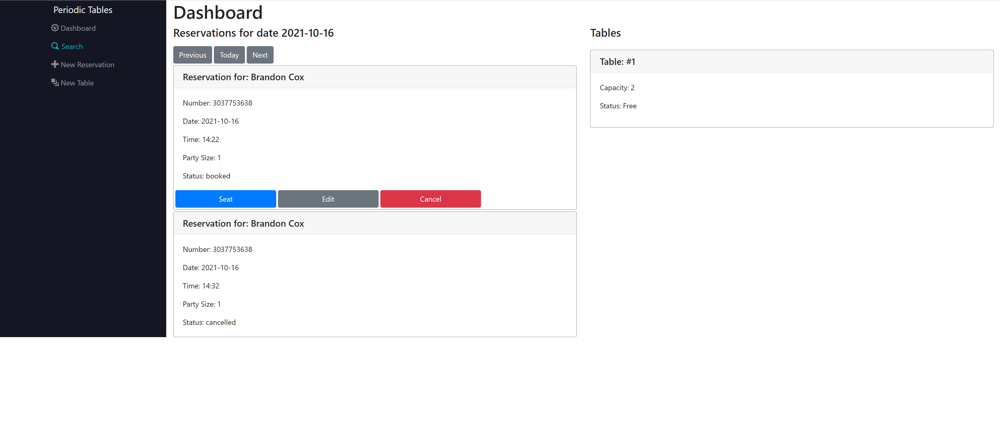
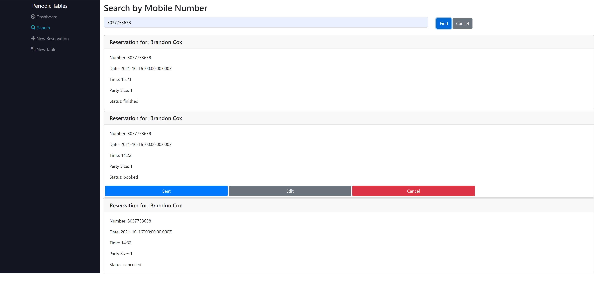
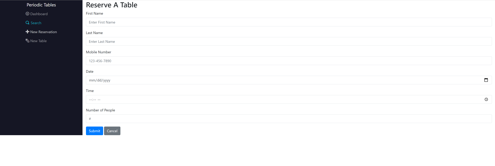
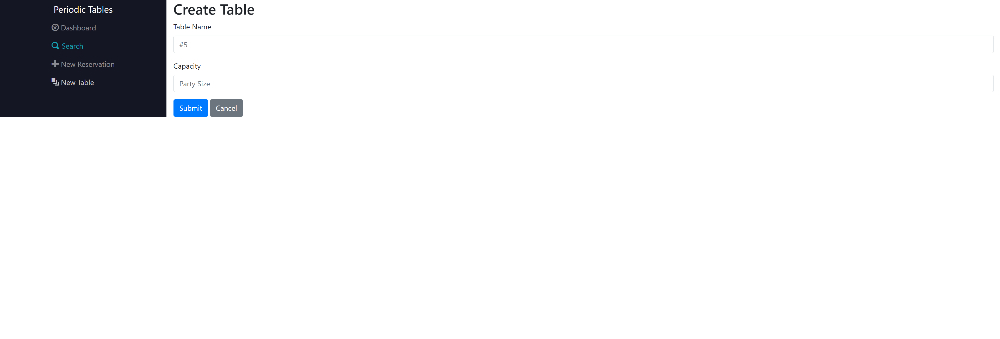
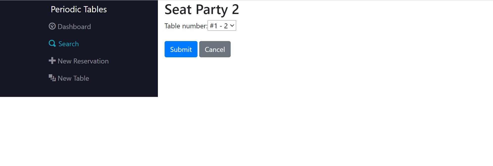
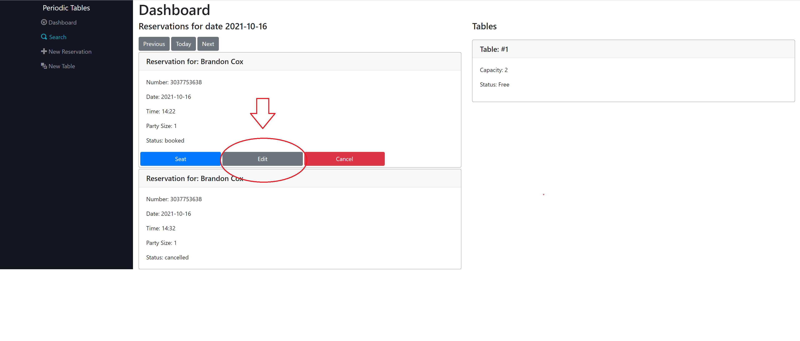
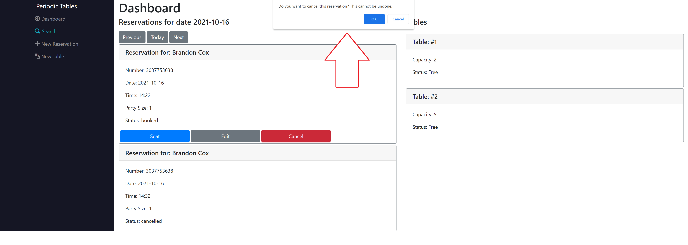

# Capstone: Restaurant Reservation System

This is a fully functioning reservation application that was created for Thinkful's Engineering Immersion program's final capstone project. It uses the following technologies: React.js, Node.js, PostgreSQL, Express.js, & Knex.js

You can view the full deployment of this application here:
https://bcox-front-reservation.herokuapp.com/dashboard

## Dashboard

```
- Shows a list of reservations.
- Shows a list of tables within the restaurant and whether or not they are available.
- Has a series of navigation buttons that take you through the availble dates.
```



## Search

- You can search for reservations based on costumers phone numbers.
- Using the "Find" button will present you with a list of the numbers.



## Create Reservation Form

- This page will present you with a form to fill out the reservation information.
- Clicking "Submit" will send the information into the databse and return the reservation on the dashboard.



## Create Table Form

- This page will present you with a form to create a new table within the restaurant for customers to sit at.
- Clicking "Submit" will send the information into the databse and return the table on the dashboard.



## Seating a Reservation

- Clicking the "Seat" bitton will open a page where you can choose any available tables from a drop down menu for reservations.
- Clicking the "Submit" button will send the information into the database and seat the reservation at the slected table.



## Editing a Reservation

- Clicking "Edit" will allow you to edit any information on a reservation.
- Clicking "Submit" will save the updated reservation into the database and dashboard.



## Cancelling a Reservation

- Clicking "Cancel" will provide a window that will ask if you would like to cancel the resevation.
- Clicking "OK" on the window will cancel the reservation status.



# API Documention

<hr>

### GET: /reservations?mobile_number=999-999-9999

Returns reservations that match the number query.

### GET: /reservations?date=YYYY-MM-DD

Returns reservations made for that date.

### POST: /reservations

Creates a new reservation

### GET: /reservations/:reservationId

Reads a reservation by reservation_id

### PUT: /reservations/:reservationId

Updates a reservation by reservation_id

### PUT: /reservations/:reservationId/status

Updates the status of a reservation by reservation_id

### GET: /tables

Lists all tables

### POST: /tables

Creates a new table

### PUT: /tables/:table_id/seat

Seats a reservation at a table

### DELETE /tables/:table_id/seat

Finishes an occupied table

##

## Installation

1. Fork and clone this repository.
1. Run `cp ./back-end/.env.sample ./back-end/.env`.
1. Update the `./back-end/.env` file with the connection URL's to your database instance.
1. Run `cp ./front-end/.env.sample ./front-end/.env`.
1. Include your backend connection within `./front-end/.env` (defaults to `http://localhost:5000`).
1. Run `npm install` to install project dependencies.
1. Run `npm run start` to start the server.
